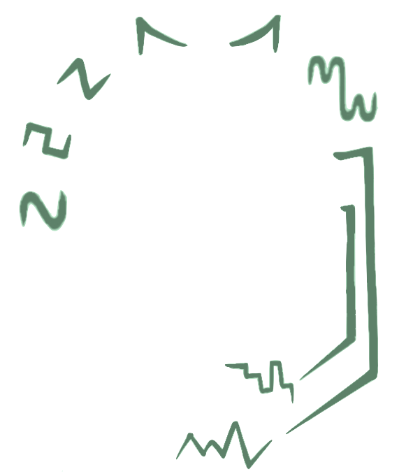

# Season of the Witch: Season 2

 
The `Season of the Witch` is, at its core, a modulating digital delay pedal. The modulation can be accomplished via an LFO circuit, which uses the new, in-house SwampLFO; a TRS-capable expression pedal; or a 0-5V TS CV signal. The digital delay is driven by the [PT2399](https://www.electrosmash.com/pt2399-analysis), a common short-range delay chip. But the `Season of the Witch` is also so much more than a modulated delay: it is a space-time manipulator, a seasick harmony machine, an ambient movie soundtrack generator, and a shoegaze tone factory all in one. 
 
 
The pedal includes standard delay controls: dry/wet `Blend`, amount of `Feedback` in the signal, and the `Delay` time.
 
 
It also includes modulation controls for the Control Signal, which will be discussed in depth later: `Rate`, `Waveform` selection, and both `Depth` controls for fine-tuned wave control (_"Control Signal"_ is any of the three types of available control: internal LFO, external TRS expression pedal, or 0-5V CV generator).
 
 
When your musical input combines with the Control Signal, the results can be otherworldly. Subtle variation of the Control Siganl produces warm, wavering sounds, much like a chorus pedal. Less-than-subtle variation produces wild, pitch-shifting, potentially-arpeggiated noises: changing the variation from gentle to almost unrecognizable.

---

## Controls

| | |
| :--- | :--- |
|  | Controls the amount of delayed signal in the output. Completely on will be nothing but delayed signal, completely off will be nothing but clean signal. |
|  | Controls the delay time. The range of usable delay times is approximately 35ms to ~500ms. Longer delay times are possible, but signal degradation is guaranteed beyond this range. Of course, if you were looking for normal-signal delay pedal, you probably wouldn't be here! |
|  | Controls the amount of feedback (number of repeats) in the signal. The pedal is capable of self-oscillation at higher settings (depending on the `Chaos` setting). |

#### Chaos
Internally, there is a trimmer for the chaos avaiable in the `Feedback` knob. Turn it up to allow for easier self-oscillation, turn it down to avoid it altogether.

## Control-Signal controls

These two settings work with all forms of modulation: internal LFO, external TRS Expression pedal, or 0-5V CV generator.

| | |
| :--- | :--- |
|  | Controls the amount of modulation on the delay time - the maximum swing of the control signal. |
|  | Controls the amount of modulation on the feedback - the maximum swing of the control signal. Feedback depth is at zero when the control is at noon. To the left is full depth out-of-phase with the delay modulation, to the right is full depth in-phase with the modulation. |

> **Pro Tip**: When entering expression (or CV) mode, you can keep either Delay or Feedback attached to the LFO by setting it's depth all the way to the left (full CCW)  

### LFO-only Controls

These two settings only affect the internal LFO.

| | |
| :--- | :--- |
|  | Controls the rate (frequency) of the LFO. The SwampLFO provides rates from as slow as 20 s up to 40 ms (38 BPM to 1500 BPM, or 0.05 Hz to 25.6Hz). |
|  | Controls the waveform of the LFO, covering: Sine, Square, Triangle, Ramp Down, Ramp Up, Sine Fourth Harmonic, Random Slopes, Random Steps. |

> **NOTE**: The `Rate` and `Waveform`  options only affect the LFO control, not the expression or CV control signals.

### Secondary Footswitch

The footswitch on the right side of the Season of the Witch is a multi-function switch. It controls both tap tempo of the LFO, as well as the Hold to Self-Oscillate function. 

#### Tap Tempo
The secondary footswitch is the tap-tempo switch for the LFO. Tap twice to enter the tempo of the LFO. _Note, this tap/interval does NOT correspond to the delay-time._

#### Hold to Oscillate
The secondary footswitch is ALSO a hold-to-self-oscillate switch. Hold the switch down, and feedback controls are set to maximum. The feedback should self-oscillate!

--- 

## Working with the Control Signals

You may have noticed that there are three Control signal options, but only one plug! The LFO is internal to the Season of the Witch, while both the Expression and CV share the same TRS jack. Expression pedals are expected to use a TRS cable as a voltage divider (therefore, a TS cable will not work appropriately) -- as an added benefit, the value of your expression pedal is irrelevant, so the Season of the Witch ought to be compatible with any-value TRS expression. CV sources are expected to provide a 0-5V signal over a TS cable (internal voltage is provided on the Ring of the TRS and may damage a TRS CV source!!).

With no controls plugged in, the LFO is the working Control Signal. Plugging any cable (TS or TRS) into the CV/Expression jack will cut-off the LFO signal and use whatever Control Signal is coming through the CV/Expression jack. For more customization, if either the `Delay` or `Feedback` is set all the way to the left when plugging a cable into the CV/Expression jack, that parameter will attach to the LFO. This means you'll be able to control the feedback with the expression pedal while the LFO modulates the delay time, or vice versa. 

### LFO
There is a lot of variation within the LFO control. Not only do the 8 waveforms offer very different sounds for modulating, but each of the `Rate`, `Depth` and `Offset` controls can change the entire soudn with subtle variation. 

### Expression
For best use of the expression control, I advise picking your heel and toe settings before beginning play. Loosely, you can think of the `Offset` setting as mapping to the heel and the `Depth` setting mapping to the toe. Set the expression pedal to heel position, tweak the offset until you're happy with the beginning position. Then move to the full toe-down position, and change the `Depth` setting to set the amount of variation you'd like.

### CV
For best use of the CV control, the advice under `Expression` setting works as well: be sure you understand your minimum and maximum positions and how these affect the delay time and feedback. 

Interestingly, even within the variation there is still variation. For example, an "unusably seasick" wobble in delay time at a lower rate setting, can become a gooey, warm vibrato at higher `Rate` settings with enough dry signal `Blend`ed in.

## Useful Settings

Let's face it. There are so many controls on this pedal, and each one opens a world of new sounds. It's normal to be a little confused or overwhelmed. I highly recommend picking a single setting and changing it over its range to get a sense of how flexible this pedal is. 

### Useful Setting 1
### Useful Setting 2
### Useful Setting 3
### Useful Setting 4

## Frequently Asked Questions // Trouble-shooting

> My Season of the Witch does (not) self-oscillate, and I do (not) want it to!

See the section about the `CHAOS` trimmer. Remove the four screws from the backplate and gaze upon the wonders inside. Adjusting the trimpot works best when you can keep some active loop or sound coming through the pedal. Turn the `FEEDBACK` knob up all the way, play your loop, and adjust the `CHAOS` trimmer until you reach your desired maximum feedback level (turn left for less feedback, right for more feedback).

> This pedal's broken!

It's (probably) not broken. There are a few things that can cause a Season of the Witch to appear deceased, and we'll talk about them here. The first is an overloading of the delay chip inside the Season of the Witch. There are a lot of degrees of freedom on this pedal, and some of those can (temporarily) kill the PT2399. The first thing to verify is that only the delay is affected: play through the pedal with the blend fully dry to ensure there is stil sound coming through. If not, please stop here, check your power supply, and then contact me on Instagram at @swampwitchpedals or via email at swampwitchpedals@gmail.com!

If all else fails, you're reading this on the internet, so I have to say: _Hello, this is IT - have you tried turning it off and on again?_. If it's still not working, please stop here, check your power supply, and then contact me on Instagram at @swampwitchpedals or via email at swampwitchpedals@gmail.com!

